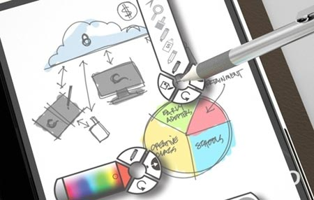
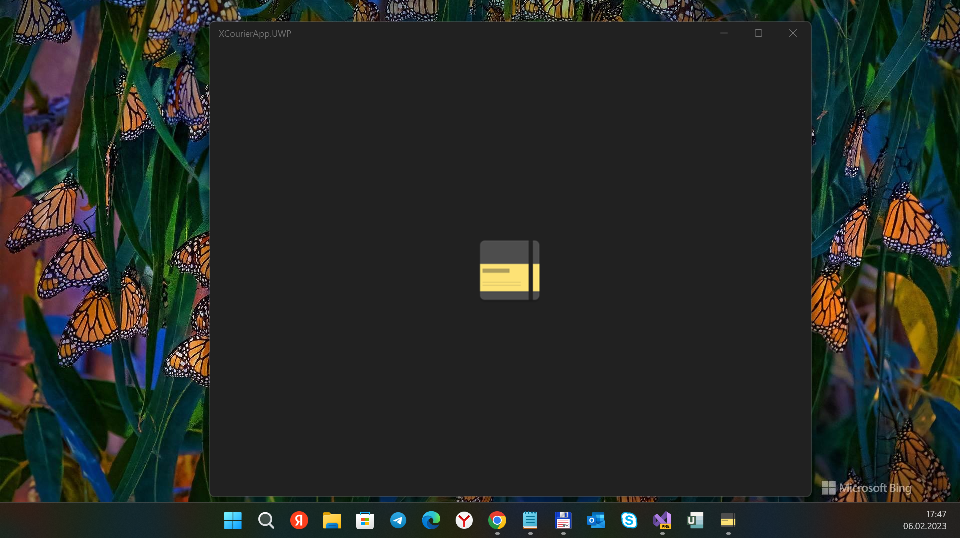

# XCourierApp
Fork of Daniel Kornev's [XCourierApp](https://github.com/danielkornev/XCourierApp) project.

## About 
In short, this is the "echo of mythic Microsoft Courier project" for "Booklet PC" (codename) :)

## Screenshots

## Status / Progress
- UWP platform/target ("stub") added
- iOS platform/target ("stub") added

## ToDo
- More RnD of this Common & Droid projects
- Transfer image resourses to UWP (iOS) projects
- Catch&Fix the UWP's LiteDB "bug":

System.Reflection.TargetInvocationException: Exception has been thrown by the target of an invocation. 

---> System.UnauthorizedAccessException: 

Access to the path 'C:\Users\Admin\source\repos\XCourierApp\XCourierApp.UWP\bin\x64\Debug\AppX\JournalAppStore.litedb' is denied.

## References / Credits
- https://github.com/danielkornev/XCourierApp	
- https://github.com/danielkornev
- https://github.com/xamarin

## ..
AS IS. No support. RnD only!

## .
[m][e] 2023