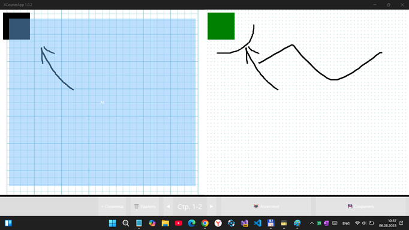

# XCourierApp v1.0.2 -- master branch
Fork of Daniel Kornev's [XCourierApp](https://github.com/danielkornev/XCourierApp) project.

## About 
In short, this is the "echo of mythic Microsoft Courier project" for "Booklet PC" (codename) :)

## Screenshots

## Status / Progress
- UWP platform/target added
- Simplest Microsoft Courier mechanics (fulfilled rect primitive canvas drawing, and up/down swipes for left pane) added 

## ToDo
- More RnD of this Common & Droid projects
- Realize "book" (journals?) "collection", and some meta-data automation.. =)
- Do more UWP app testing

## Far future / Additional
- Think about potring to UNO platform (Win. / Linux Desktops...)
- Some AI (LLM or Cloud?) integration :)

## References / Credits
- https://github.com/danielkornev/XCourierApp Original "XCourierApp" project (Android only?)	
- https://github.com/danielkornev Daniel Kornev, author of original XCourierApp
- https://github.com/xamarin Xamarin Forms, plugins, etc.

## ..
AS IS. No support. RnD only!

## .
[M][E] July, 6 2025

